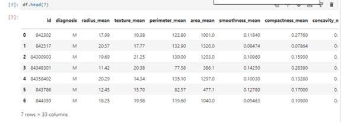
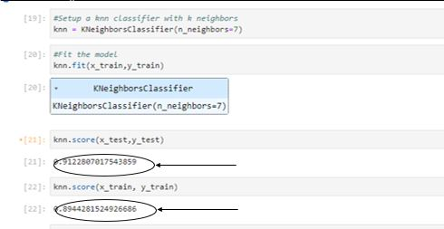

Breast-Cancer-Classification-KNN
A machine learning project that uses the K-Nearest Neighbors (KNN) algorithm to classify breast cancer diagnoses as benign or malignant. The project includes data preprocessing, feature normalization, model training, evaluation, and visualization, achieving an average classification accuracy of 92%.
# Breast Cancer Classification using K-Nearest Neighbors (KNN)

# Project Overview
This project applies the **K-Nearest Neighbors (KNN)** machine learning algorithm to classify breast cancer tumors as **benign** or **malignant** based on medical features from the Breast Cancer Wisconsin dataset.

The project was developed as part of a **Data Mining** course and demonstrates the complete machine learning workflow, including data preprocessing, model training, evaluation, and visualization.


## Features
- Data cleaning
- Data normalization
- Dataset reduction
- KNN classification
- Model evaluation
- Confusion Matrix visualization

## Dataset
The dataset contains **569 samples** and **33 columns**. The features were extracted from digitized images of **Fine Needle Aspirate (FNA)** of breast masses and describe characteristics of the cell nuclei.

**Target Variable (Diagnosis):**
- **0** = Benign
- **1** = Malignant

## Technologies
- Python
- Jupyter Notebook
- Pandas
- NumPy
- Scikit-learn
- Matplotlib

## Results
- Best K value: **7**
- Training Accuracy: **92%**
- Testing Accuracy: **89%**


## Repository Contents
KNN_Breast_Cancer_Classifier.ipynb   # Source code
data.csv                            # Dataset
Presentation.pptx                   # Project presentation
README.md                           # Project documentation
```

## Author
**Buthaina Ali**
